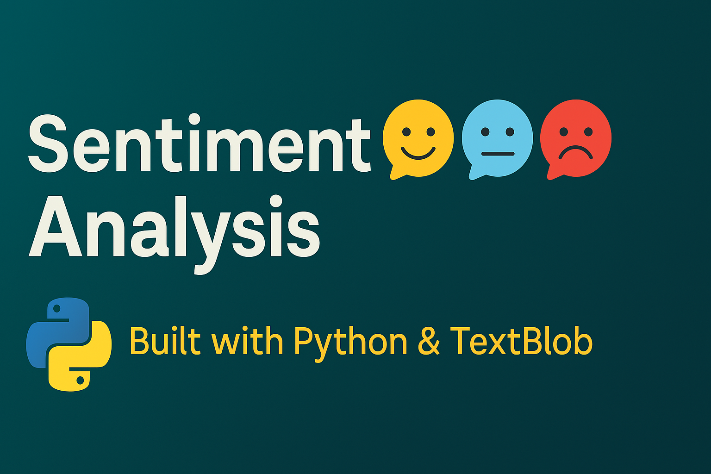

<p align="center">
  
</p>

# Sentiment Analysis 🧠💬
A simple and effective sentiment analysis tool built using Python and TextBlob.  
This project analyzes text data and classifies it into Positive, Negative, or Neutral sentiment categories.

## 📌 Features

- Input any text and get sentiment prediction
- Uses TextBlob for natural language processing
- Lightweight and easy to use

## 🚀 Demo

Try the Colab version 👉 [](https://colab.research.google.com/github/harika1807/CodeClauseInternship_SentimentAnalysis/blob/main/SentimentAnalysis.ipynb)

## 🛠️ Technologies Used

- Python
- TextBlob
- Jupyter Notebook / Google Colab

## 📦 Installation

1. Clone the repository:
   ```bash
   git clone https://github.com/harika1807/CodeClauseInternship_SentimentAnalysis.git
   cd CodeClauseInternship_SentimentAnalysis
   
2. Install dependencies:
   ```bash
   pip install -r requirements.txt


🧪 **How to Use**

You can either:
Run SentimentAnalysis.ipynb in Google Colab, or
Use it locally by running the code in any Jupyter Notebook.

📜 **License**
This project is licensed under the MIT License. 
See the LICENSE file for details.

🤝 Contributing
Contributions are welcome!
1. Fork the repository
2. Create your feature branch:
   ```bash
   git checkout -b feature/FeatureName
3. Commit your changes
4. Push to the branch
5. Open a pull request 🚀

Made with ❤️ as part of the CodeClause Artificial Intelligence Internship.
